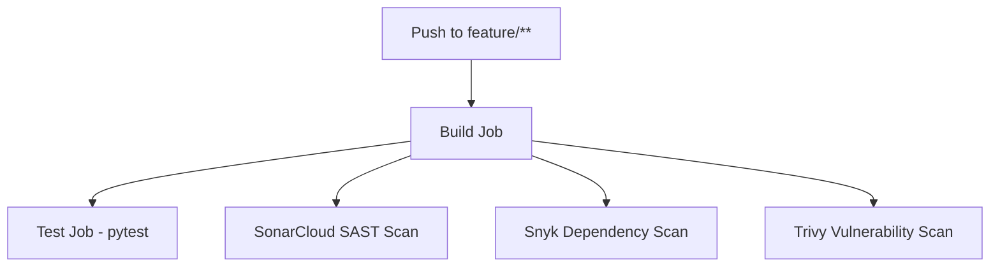

# GitOps EKS Deployment & DevOps Demo API

A modern, containerized Python Flask REST API built with a complete DevSecOps CI/CD pipeline and GitOps workflow architecture designed for Kubernetes / Amazon EKS deployments.

---

## 📋 Table of Contents

- [Overview](#overview)
- [Features](#features)
- [Project Structure](#project-structure)
- [API Endpoints](#api-endpoints)
- [Getting Started](#getting-started)
  - [Prerequisites](#prerequisites)
  - [Local Setup](#local-setup)
  - [Running Tests](#running-tests)
- [Docker Usage](#docker-usage)
- [CI/CD & DevSecOps Pipeline](#cicd--devsecops-pipeline)
  - [Pipeline Architecture](#pipeline-architecture)
  - [Reusable Workflows](#reusable-workflows)
  - [Required Secrets](#required-secrets)
- [GitOps Deployment Workflow](#gitops-deployment-workflow)

---

## 🌟 Overview

This repository demonstrates best practices for cloud-native application development and deployment:
- **Lightweight Microservice**: Built with Python 3.12 and Flask.
- **Automated Testing**: Unit tests using `pytest`.
- **Containerization**: Optimized `Dockerfile` based on `python:3.12-slim`.
- **Modular DevSecOps**: GitHub Actions workflows incorporating SAST (SonarCloud), SCA (Snyk), and container/filesystem security scanning (Trivy).
- **GitOps Ready**: Structured to integrate seamlessly with GitOps engines (e.g., ArgoCD, Flux) for automated deployment to Amazon EKS.

---

## ✨ Features

- **Health & Info Endpoints**: Native `/health` probe endpoints ready for Kubernetes liveness and readiness probes.
- **Automated Code Quality & Security Gates**:
  - **SonarCloud**: Static code analysis & code quality gates.
  - **Snyk**: Dependency vulnerability scanning (high/critical threshold).
  - **Trivy**: Comprehensive filesystem and vulnerability scanner.
- **Reusable GitHub Actions**: DRY workflow architecture using `workflow_call`.

---

## 📁 Project Structure

```text
gitops-eks-deployment/
├── .github/
│   └── workflows/
│       ├── feature-pipeline.yml       # CI pipeline for feature branches
│       └── reusable/                  # Modular, reusable workflow definitions
│           ├── build.yml              # Setup, dependency install & compilation check
│           ├── test.yml               # Automated test execution with pytest
│           ├── sonarcloud.yml         # SonarCloud SAST code quality analysis
│           ├── snyk.yml               # Snyk dependency vulnerability scanning
│           └── trivy.yml              # Trivy filesystem vulnerability scan
├── app/
│   ├── __init__.py                    # App package initialization
│   └── main.py                        # Flask API application and routes
├── tests/
│   └── test_main.py                   # Pytest test cases for API endpoints
├── .dockerignore                      # Build context exclusion rules
├── .gitignore                         # Git exclusion rules
├── Dockerfile                         # Production-ready multi-stage/slim Dockerfile
├── requirements.txt                   # Python dependencies (Flask, pytest)
├── sonar-project.properties           # SonarCloud scanner configuration
└── README.md                          # Project documentation
```

---

## 🔌 API Endpoints

The API runs on port `5000` by default.

| Method | Endpoint | Description | Sample Response |
| :--- | :--- | :--- | :--- |
| `GET` | `/` | Root API greeting | `{"application": "devops-demo-api", "message": "Hello from DevOps Demo API"}` |
| `GET` | `/health` | Health check endpoint (for K8s probes) | `{"status": "healthy"}` |
| `GET` | `/api/version` | Current application version | `{"application": "devops-demo-api", "version": "1.0.0"}` |
| `GET` | `/api/info` | Deployment metadata & environment info | `{"application": "devops-demo-api", "environment": "development", "message": "Feature branch deployment"}` |

---

## 🚀 Getting Started

### Prerequisites

- **Python 3.12+**
- **Docker** (optional, for containerized execution)
- **Git**

### Local Setup

1. **Clone the repository:**
   ```bash
   git clone https://github.com/Prashant260/gitops-eks-deployment.git
   cd gitops-eks-deployment
   ```

2. **Create and activate a virtual environment:**
   ```bash
   # Linux / macOS
   python3 -m venv .venv
   source .venv/bin/activate

   # Windows (PowerShell)
   python -m venv .venv
   .venv\Scripts\Activate.ps1
   ```

3. **Install dependencies:**
   ```bash
   pip install --upgrade pip
   pip install -r requirements.txt
   ```

4. **Run the application:**
   ```bash
   python -m app.main
   ```

5. **Test the endpoints:**
   ```bash
   curl http://localhost:5000/
   curl http://localhost:5000/health
   curl http://localhost:5000/api/version
   curl http://localhost:5000/api/info
   ```

### Running Tests

Execute unit tests with `pytest`:

```bash
pytest -v
```

---

## 🐳 Docker Usage

### Build the Docker Image

```bash
docker build -t devops-demo-api:latest .
```

### Run the Container

```bash
docker run -d -p 5000:5000 --name demo-api devops-demo-api:latest
```

### Verify Container Status

```bash
# Check container logs
docker logs -f demo-api

# Test endpoint
curl http://localhost:5000/health
```

### Stop and Remove Container

```bash
docker stop demo-api && docker rm demo-api
```

---

## 🔄 CI/CD & DevSecOps Pipeline

The CI/CD pipeline is implemented using GitHub Actions and enforces DevSecOps best practices on every push to feature branches (`feature/**`).

### Pipeline Architecture



### Reusable Workflows

Workflows are broken down into reusable modules located in `.github/workflows/reusable/`:

1. **`build.yml`**: Validates Python environment, installs dependencies, and tests compilation (`py_compile`).
2. **`test.yml`**: Runs the full `pytest` test suite.
3. **`sonarcloud.yml`**: Runs SonarSource analysis using `sonar-project.properties`.
4. **`snyk.yml`**: Scans Python dependencies for high/critical security vulnerabilities.
5. **`trivy.yml`**: Scans the filesystem for vulnerabilities and configuration issues.

### Required Secrets

To enable all security scanning integrations in GitHub Actions, configure the following repository secrets under **Settings > Secrets and variables > Actions**:

| Secret Name | Description |
| :--- | :--- |
| `SONAR_TOKEN` | SonarCloud API token for code analysis |
| `SNYK_TOKEN` | Snyk API authentication token |

---

## ☸️ GitOps Deployment Workflow

This microservice is built to fit into a GitOps delivery model targeting Kubernetes (Amazon EKS):

1. **Developer pushes code** to a feature branch, triggering the CI/DevSecOps validation pipeline.
2. **Merging to `main`** builds and pushes the production container image with a unique SHA/tag to an image registry (e.g., Amazon ECR, Docker Hub).
3. **GitOps Repository / Manifests** (Helm / Kustomize) are updated with the new image tag.
4. **GitOps Controller** (ArgoCD / Flux) running inside the Amazon EKS cluster detects manifest changes and synchronizes the cluster state automatically.
5. **Kubernetes Probes** monitor container health via the `/health` endpoint.
